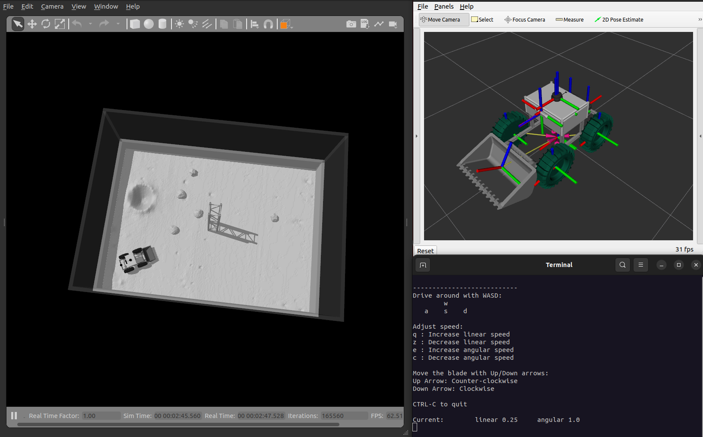
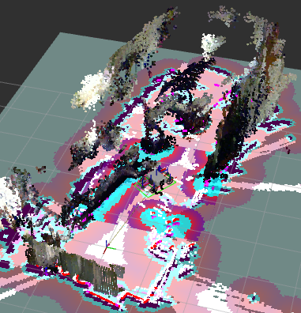

# Project Overview

This repository contains the software developed by the College of DuPage team for the 2024-2025 NASA Lunabotics competition. It is built for ROS 2 Humble on Ubuntu 22.04.

## System Components

- Intel NUC 13 Pro
- RPLidar S2L
- RPLidar A3
- Intel RealSense D456 Depth Camera
- REV Robotics Neo Vortex (x4)
- REV Robotics Spark Flex (x4)
- REV Robotics Spark Max (x4)
- Turnigy 14.8V 8000mAh LiPo Battery
- Turnigy 14.8V 12000mAh LiPo Battery
- AndyMark Power Distribution Panel
- MKS CANable Pro

## Software Requirements

- rtabmap
- rtabmap_ros
- rplidar_ros
- apriltag_ros
- navigation2
- robot_localization
- laser_filters
- imu_complementary_filter
- ros2_control
- ros2_controllers
- gazebo_ros2_control

## Installation
Note: You will need to have already installed ROS 2 Humble before continuing with installation. The guide can be found [here](https://docs.ros.org/en/humble/Installation/Ubuntu-Install-Debs.html). Install both `ros-humble-desktop` and `ros-dev-tools`.

#### 1. Setup workspace and clone repository

``` bash
mkdir -p ~/lunabot_ws/src  
cd ~/lunabot_ws/src  
git clone https://github.com/grayson-arendt/Lunabotics-2025.git  
```

#### 2. Install dependencies

Run the installation script to install the required dependencies. `chmod +x` gives permission for the script to be executable. In any step that `chmod +x` is used, it will only need to be ran once.

``` bash
cd ~/lunabot_ws/src/Lunabotics-2025/scripts  
chmod +x install_dependencies.sh
sudo ./install_dependencies.sh   
```

#### 3. Build the workspace

``` bash
cd ~/lunabot_ws  
colcon build  
```

## Simulating the Robot

Gazebo simulation can be slow depending on your computer's specifications. You can control the robot with an Xbox One controller by specifying the control mode with `control_mode:=xbox`. In this mode, the left joystick controls the drivetrain, while the right joystick’s y-axis moves the dozer blade.

#### 1. Navigate to workspace and source setup

``` bash
cd ~/lunabot_ws  
source install/setup.bash  
```

#### 2. Launch Gazebo and RViz2

``` bash
ros2 launch lunabot_bringup simulation_launch.py control_mode:=keyboard #control_mode:=xbox
```  

<p align="center">
  
</p>

## Running the Physical Robot

### Configure Device Permissions

The rplidar_ros package needs to access /dev/ttyUSB0 and /dev/ttyUSB1 (using both lidars). While you can run `sudo chmod +x 777 /dev/ttyUSB0` for example, it would need to be ran each time on startup. 

#### 1. Add user to dialout group then restart the computer

``` bash
sudo usermod -a -G dialout $USER  
```

Use `ls /dev/ttyUSB*` to identify device numbers if the lidars are disconnected and reconnected, then adjust the lidar parameters in `hardware_launch.py` accordingly.


#### 2. Setup camera udev rules
``` bash
cd ~/lunabot_ws/src/Lunabotics-2025/scripts  
chmod +x setup_udev_rules.sh
sudo ./setup_udev_rules.sh  
```

Make sure all cameras are unplugged while setting up the udev rules.

### Running Launch Files

#### 1. Initialize SocketCAN

```bash
cd ~/lunabot_ws/src/Lunabotics-2025/scripts/  
chmod +x canable_start.sh
./canable_start.sh  
```

#### 2. Source workspace setup

```bash
cd ~/lunabot_ws  
source install/setup.bash
```  

#### Open separate terminal windows and source the workspace setup for each next step:

#### 3. Visualize with RViz2 (on host computer)

```bash
ros2 launch lunabot_bringup external_launch.py  
```

#### 4. Launch hardware

```bash
ros2 launch lunabot_bringup hardware_launch.py  
```

#### 5. Start RTAB-Map for mapping

```bash
ros2 launch lunabot_bringup mapping_launch.py  
```

#### 6. Start Navigation2 for navigation

```bash
ros2 launch lunabot_bringup navigation_launch.py  
```

In RViz2 on the host computer, you will now be able to select a "Nav2 Goal" in the GUI and have the robot navigate to that location. 


#### (Optional) 7. Start navigator client 

```bash
ros2 run lunabot_autonomous navigator_client 
``` 

The action client will send two goals, one for excavation zone and another for construction zone. After the goal has been reached, it will publish to /control topic and enable the specific
motors for the mechanisms for the zone.

<p align="center">
  
</p>

## Project Structure

**lunabot_autonomous**
  - **src**
    - **physical_robot**
      - **control**
        - **robot_controller.cpp**: This node is responsible for generating control commands (like percent output) for the robot’s physical motors. It receives higher-level commands and converts them into motor control signals that are sent using the sparkcan package.
      - **system**
        - **hardware_monitor.cpp**: A monitoring system that tracks the status of various sensors and checks their liveliness. If a sensor fails to send data or shows errors, this node will flag the issue and print colored error text in terminal.
        - **imu_rotator.cpp**: Handles IMU (Inertial Measurement Unit) data. It converts the raw IMU readings into a coordinate frame that can be used for localization, rotating them into the ENU (East-North-Up) frame.
        - **navigator_client.cpp**: An action client that sends autonomous goals to the robot. It communicates with the navigation system to direct the robot to specified waypoints and publishes a control message that is used by robot_controller.cpp. This control message sends a boolean whether or not to enable a robot mechanism.
    - **simulated_robot**
      - **teleop**
        - **keyboard_teleop.py**: A Python script for manually controlling the robot in the simulation using a keyboard. The script maps key presses to movement commands for the robot, enabling driving and blade movement in Gazebo.
      - **blade_joint_controller.cpp**: This node controls the rotation of the bulldozer blade in the Gazebo simulation. It manages the blade’s positioning by sending commands to the ros2_control position controller.
      - **topic_remap.cpp**: Remaps topics between the ros2_control interface and the simulation environment. This is needed to ensure the simulation is receiving and sending data on the correct topics for motor control and odometry.

**lunabot_bringup**
  - **behavior_trees**
    - **navigate_to_pose_w_replanning_goal_patience_and_recovery.xml**: A behavior tree used in conjunction with the Navigation2 stack. This tree allows the robot to navigate autonomously while handling issues like goal replanning, patience when navigating to a location, and recovery behaviors if obstacles are encountered.
  - **config**
    - **default_view.rviz**: Configuration file for RViz2, defining how the robot and its environment are displayed. This includes camera angles, display options for sensors, and robot model visualization settings.
  - **launch**
    - **external_launch.py**: Launches the necessary nodes for RViz2 and robot state/joint publishers. This is used on external systems to visualize the robot and its state in real time.
    - **hardware_launch.py**: Launches the nodes required to bring up the physical robot's hardware, including lidar sensors, depth cameras, and motor controllers.
    - **mapping_launch.py**: Launches RTAB-Map, a real-time appearance-based mapping node used for simultaneous localization and mapping (SLAM). This allows the robot to create a map of its environment while also localizing itself within that map.
    - **navigation_launch.py**: Launches Navigation2, which provides autonomous navigation capabilities. It uses sensor data, the map, and the robot’s position to plan and execute paths to goals set by the user or an action client.
  - **params**
    - **a3_lidar_params.yaml**: Parameter file that contains specific settings for processing data from the RPLidar A3. This includes parameters for the laser filter and other lidar-specific settings.
    - **ekf_params.yaml**: Parameters for the Extended Kalman Filter (EKF) used by the robot localization node. This file defines how sensor data like IMU, GPS, and wheel encoders are fused to provide an accurate estimate of the robot’s position.
    - **nav2_params.yaml**: Configuration parameters for the Navigation2 stack, including settings for path planners, controllers, and costmaps used during autonomous navigation.
    - **s2l_lidar_params.yaml**: Similar to `a3_lidar_params.yaml`, but this file contains parameters specific to the RPLidar S2L.
    - **sim_params.yaml**: Defines parameters for the Gazebo controllers that simulate the robot’s motors and sensors, ensuring that the simulated environment behaves like the physical robot.
    - **tag_params.yaml**: Parameters for the apriltag_ros package, which detects AprilTag fiducial markers for robot localization and mapping purposes.

**lunabot_description**
  - **meshes**: Contains the 3D models (in STL format) used to visualize the robot in RViz2 and Gazebo.
    - **base_link.stl**: Mesh for the robot's base frame.
    - **blade_link.stl**: Mesh for the robot's bulldozer blade.
    - **camera_link.stl**: Mesh for the camera.
    - **ebox_link.stl**: Mesh for the electronics box containing the onboard computer and other electronics.
    - **lidar1_link.stl**: Mesh for the mounting of the A3 lidar.
    - **lidar2_link.stl**: Mesh for the S2 lidar.
    - **nuc_link.stl**: Mesh for the Intel NUC.
    - **wheel_link.stl**: Mesh for the robot's wheels.
  - **models**: Contains models of environmental objects used in the Gazebo simulation.
    - **column**: A model of the Artemis Arena central support column.
    - **lunar_surface**: A model representing the lunar surface, simulating rough terrain for the robot.
    - **rock_rough**: A rough rock model used for simulating obstacles.
    - **rock_round**: A round rock model used for simulating obstacles.
    - **textures**: Texture files used to provide realistic appearances to the models in the Gazebo simulation.
  - **urdf**
    - **common_properties.xacro**: Defines common properties like material colors for various parts of the robot.
    - **sim_bot.xacro**: The URDF (Unified Robot Description Format) file for the robot used in Gazebo simulations, containing links, joints, and sensors specific to the simulated version of the robot.
    - **test_bot.xacro**: The URDF file for a test version of the physical robot. This is used during development to visualize while experimenting with different configurations on the test robot.
  - **worlds**: Contains the Gazebo world definitions for the simulation.
    - **artemis_arena.world**: A Gazebo world simulating the Artemis Arena, which includes terrain and obstacles that resemble the conditions the robot may face during the Lunabotics competition.

**lunabot_external**  
  - **rf2o_laser_odometry**: A package from an external source used to compute laser odometry (estimating the robot's position over time based on lidar data). This helps in providing continuous localization without relying solely on wheel encoders.

**scripts**
  - **canable_start.sh**: A script for setting up the CAN interface on the robot. This ensures that the robot’s motor controllers can communicate with the onboard computer via the CAN bus.
  - **install_dependencies.sh**: A script that installs all the necessary dependencies for the robot's software stack, such as ROS 2 packages.
  - **setup_udev_rules.sh**: A script for configuring udev rules specifically for the Intel RealSense D456 camera, ensuring that the device is automatically recognized and configured when connected to the robot.
